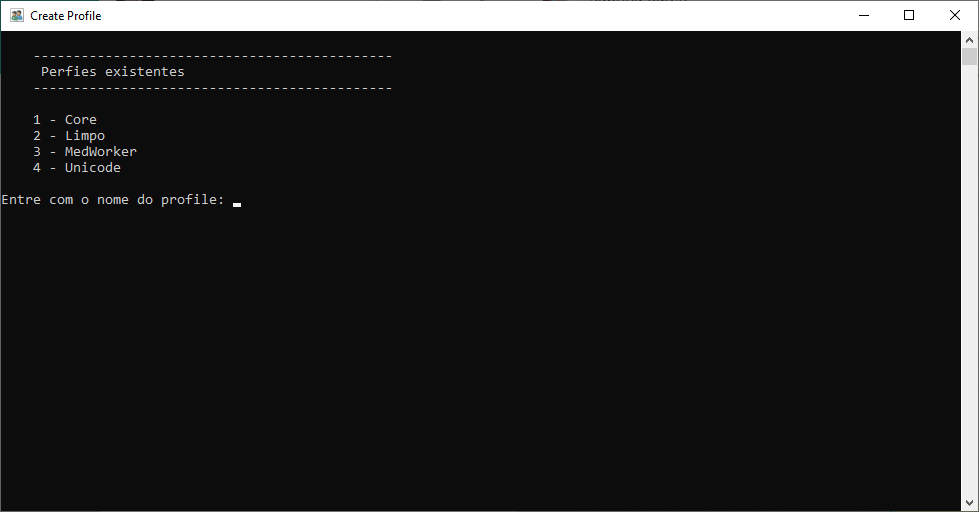
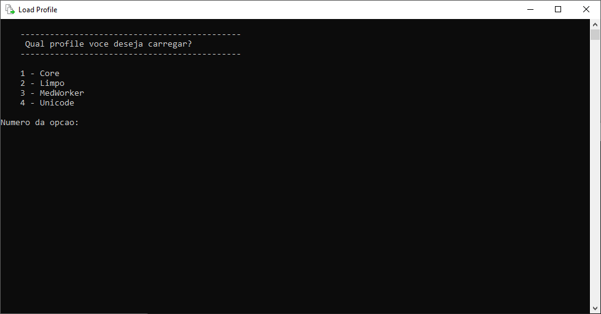

# Github Desktop Profile

Create profiles for Github Desktop.

## Create a profile

Enter a name for the profile, press enter and you're done!

Choose the profile number, press enter and you're done!

